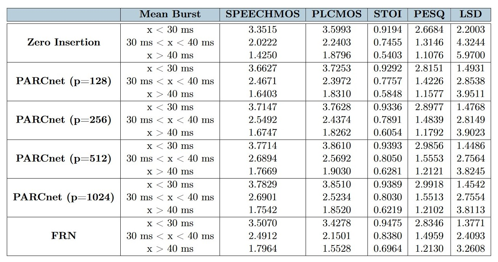
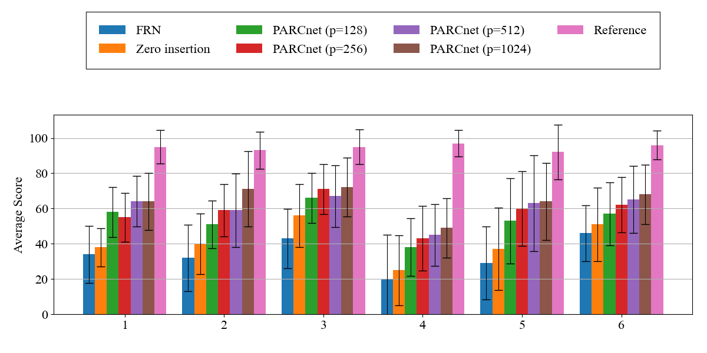
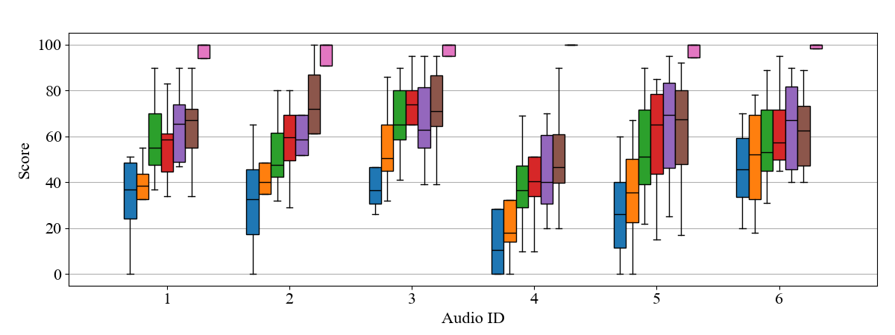

# PARCnet: a new hybrid packet loss concealment technique for speech applications based on LPC and deep residual learning

# 1. Results

We present an hybrid technique where a feed-forward neural network and an autoregressive model cooperate in order to reconstruct the lost packets. The model under consideration is PARCnet, a recent PLC technique which has demonstrated excellent results in the field of realtime music networks in terms of auditory perception and time inference. The main goal of this work is to move from the musical domain to that of speech, trying to replicate the excellent results of the original model thanks to new implementation of the two branches and training strategies. Our new model has been tested with state-of-the-art objective metrics and with a perceptual test on a sample of listeners. Results confirm that such method outperforms the baselines taken into consideration and it charts a new course for addressing the PLC problem.

The performance of the new PARCnet method has been tested against several baselines. The first baseline is zero insertion. As second baseline we decided to test on the same evaluation set the best FRN model provided by the authors: it will therefore be possible to compare the network with the version of PARCnet that uses it in its neural branch and examine differences or improvements. Furthermore, 4 versions of PARCnet have been trained; they all make predictions from a 7-packet context, but differ from each other in the order of the autoregressive model used. The linear AR models have been implemented using p = [128, 256, 512, 1024] as order. This decision has been  made to observe how the performance of a model changes as the order of the linear branch varies. 

We decided to divide the testing set into 3 subsets based on the average burst length of each audio file. In this way it will be possible to test the model on audio excerpts in different abruption conditions. We decided to use the average burst length as a reference compared to the percentage of lost packets because it is more indicative in terms of signal degradation. The mean burst length is significative for all the models taken into consideration because the larger the bursts, the more difficult the model will have to predict the samples. Results are shown in the following table:



The results of our new hybrid model are in line with FRN’s performance on this new data. However, the performance in auditory perception is significantly better and confirmed by the results of a MUSHRA test done to confirm our hypotheses. This lack of correlation suggests that measures like PESQ, STOI and LSD don't fully capture the subjective aspects of audio quality. While these metrics provide a quantitative assessment, they often miss factors such as naturalness, smoothness and overall listener satisfaction, which are crucial for perceived audio quality. Below are the histogram and whisker plot of the test taken on 12 participants:




The trained models can be found at this link: https://www.dropbox.com/scl/fo/tzwhna6d0xdyjinsmcwwn/AG7ls_jefzww8T3v4_7ME6U?rlkey=84c2eeyaoevxwbik8ryaw0189&st=rm1mbve8&dl=0

We also provide several audio samples for comparison at   !public repository index.html!

# 2. Installation

## Setup

### Clone the repo

```
$ git clone https://github.com/Marco9723/PLC_Thesis.git
$ cd PLC_Thesis
```

### Create environment and install requirements

* Create a Python 3.9 environment with Conda:
   ```
   $ conda create -n frn python=3.9
   $ conda activate frn
   ```
* Install requirements:
    ```
    $ pip install -r requirements.txt 
    ```

# 3. Data preparation

* Download and extract the dataset. In our paper, we used the [VCTK](https://datashare.ed.ac.uk/handle/10283/3443) dataset.
    ```
    $ wget http://www.udialogue.org/download/VCTK-Corpus.tar.gz -O data/vctk/VCTK-Corpus.tar.gz
    $ tar -zxvf data/vctk/VCTK-Corpus.tar.gz -C data/vctk/ --strip-components=1
    ```

  After that, the `./data` directory should be organized as follows:

    ```
    .
    |--data
        |--vctk
            |--wav48
                |--p225
                    |--p225_001.wav
                    ...
            |--train.txt   
            |--test.txt
    ```
* To load the dataset, you need text files that list the audio paths for training and testing.
  We have prepared train.txt and test.txt files in the ./data/vctk directory.

* In `./data` it is recommended to also save the files and traces of the testing set: 

    ```
    .
    |--data
        |--vctk
        |--traces
        |--testing
    ```


# 4. Run the code

## Configuration

* Configure your experiments in `config.py` 

## Training

* Adjust training hyperparameters in `config.py`.

* Modify paths where needed. If necessary, recheck the imports if they cause problems.

* The train folder contains the main files of the autoregressive training with teacher forcing.

* Run `main.py`:
    ```
    $ python main.py --mode train
    ```
* In case you want to continue training from one of these versions, just set the argument `--version` of the above command to your desired version number. For example:
    ```
    # resume from version 0
    $ python main.py --mode train --version 0
    ```

## Evaluation  

* Get your evaluation set and modify paths where needed. If necessary, recheck the imports if they cause problems.
  
* Modify `config.py` to change evaluation setup if necessary.
  
* Run `testing.py`, preferably on GPU. This script calculates metrics for all audio files and averages them:
    ```
    $ python testing.py 
    ```
    
* To reconstruct a lossy file run "reconstruct.py". This script returns the reconstructed output for a single lossy audio file.
    ```
    $ python reconstruct.py 
    ```

* You will probably need to modify `CONFIG.TEST.in_dir` to your input directory.
  

## Configure a new dataset   

The implementation can be easily extended to a new one.

* Prepare the new versions of `train.txt` and `test.txt`. 

* Modify the dictionary in `CONFIG.DATA.data_dir`:
    ```
    {
    'root': 'path/to/data/directory',
    'train': 'path/to/train.txt',
    'test': 'path/to/test.txt'
    }
    ```
* Ensure that each line in train.txt and test.txt, when combined with 'root', forms a valid path to the corresponding audio file.


